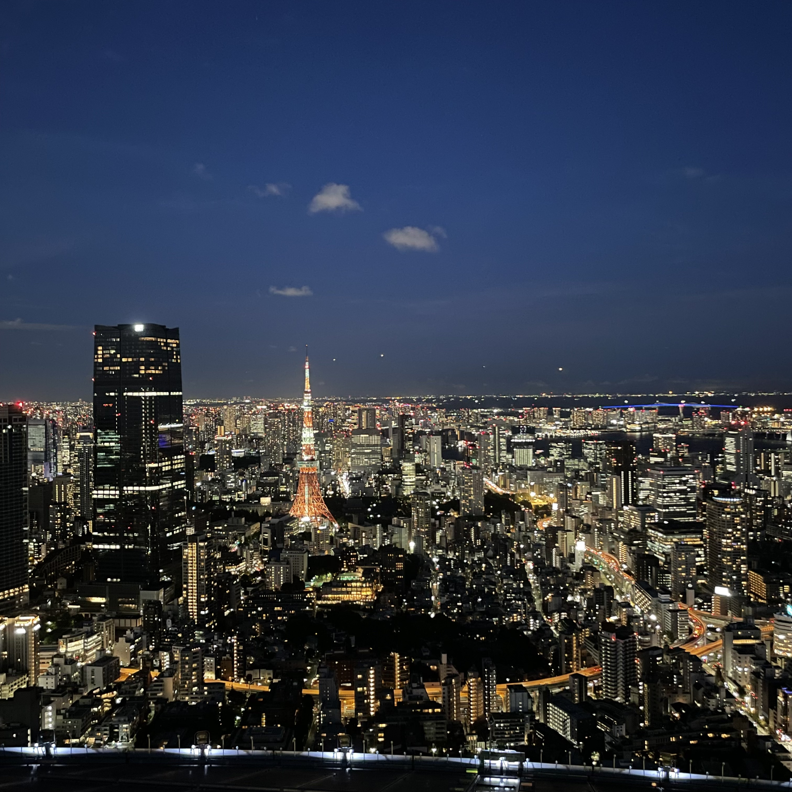
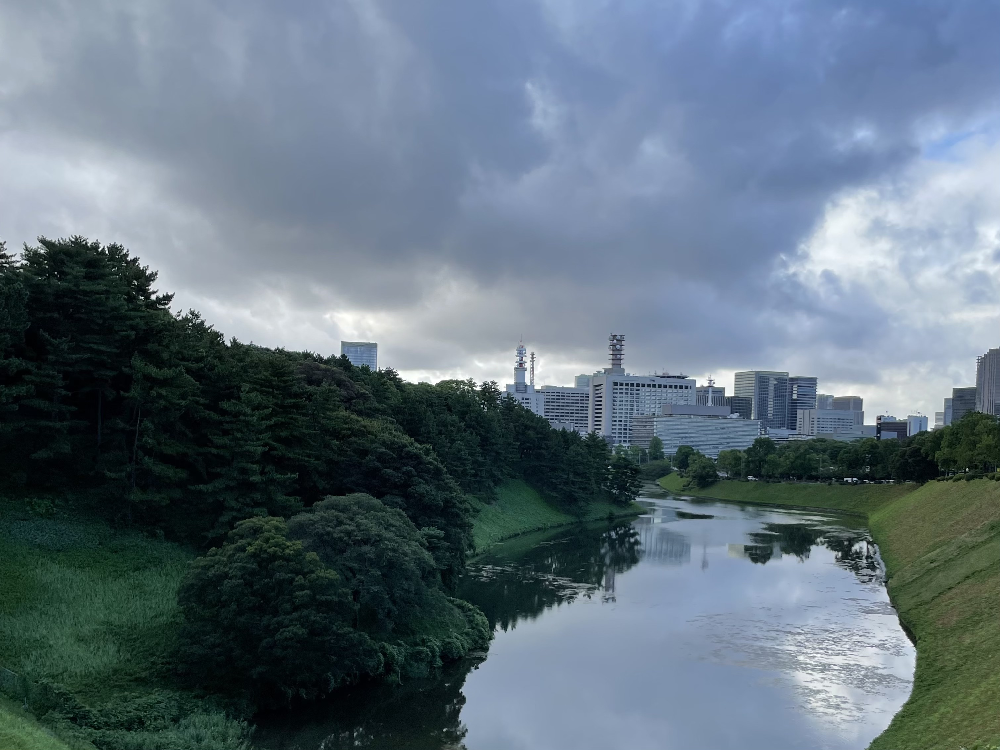
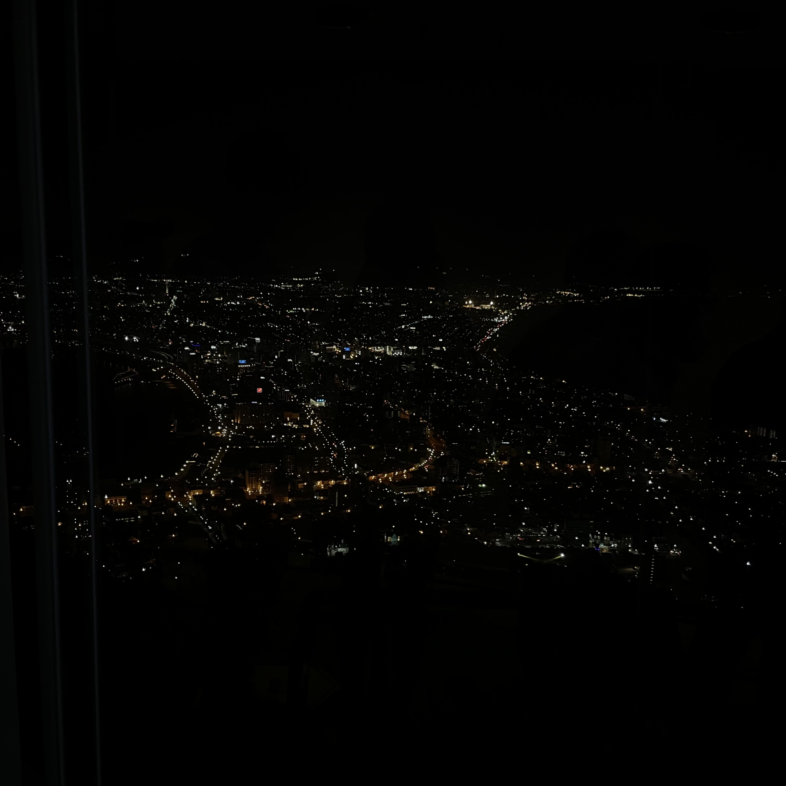
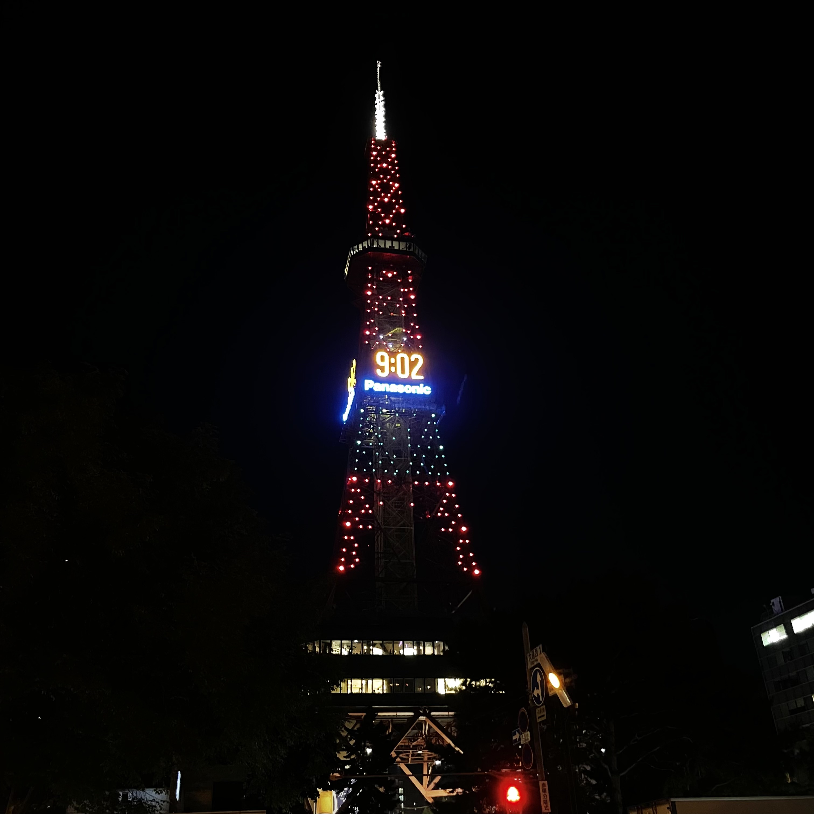
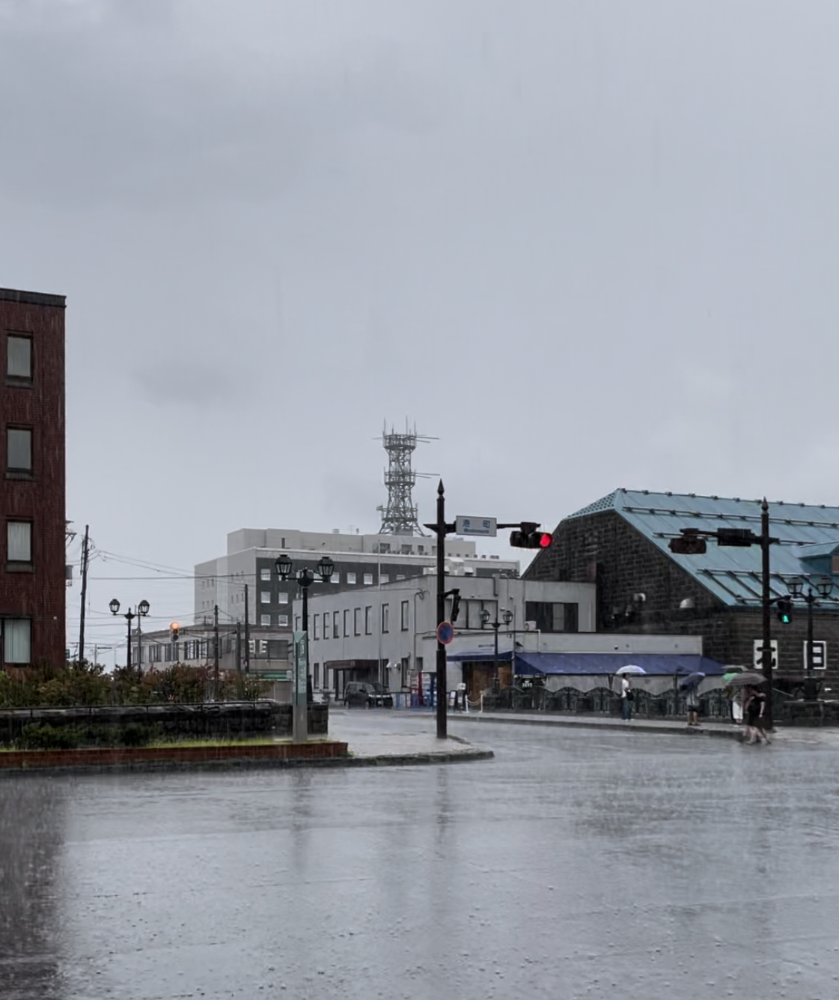
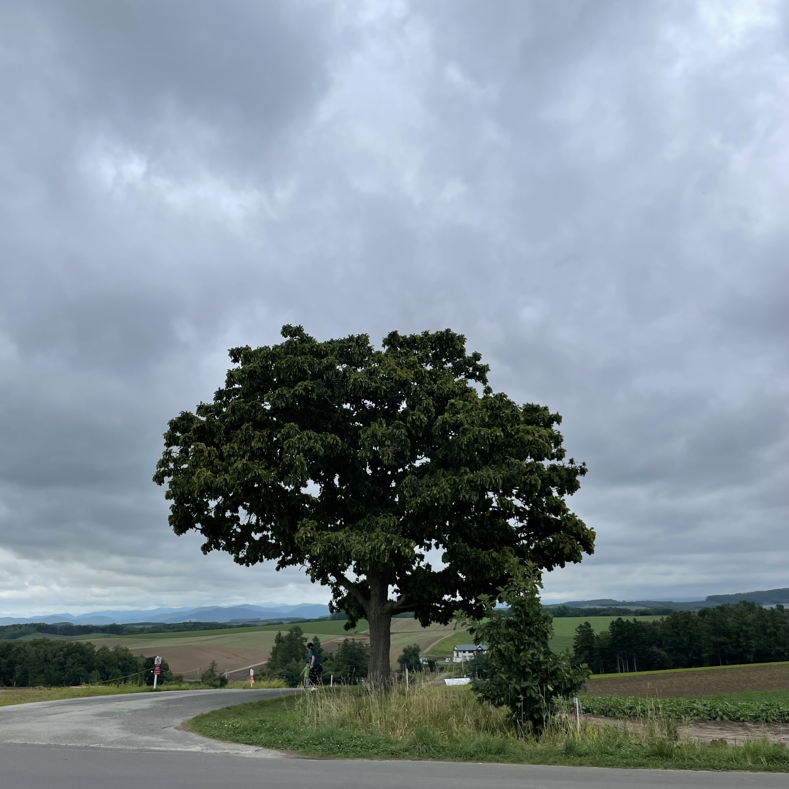
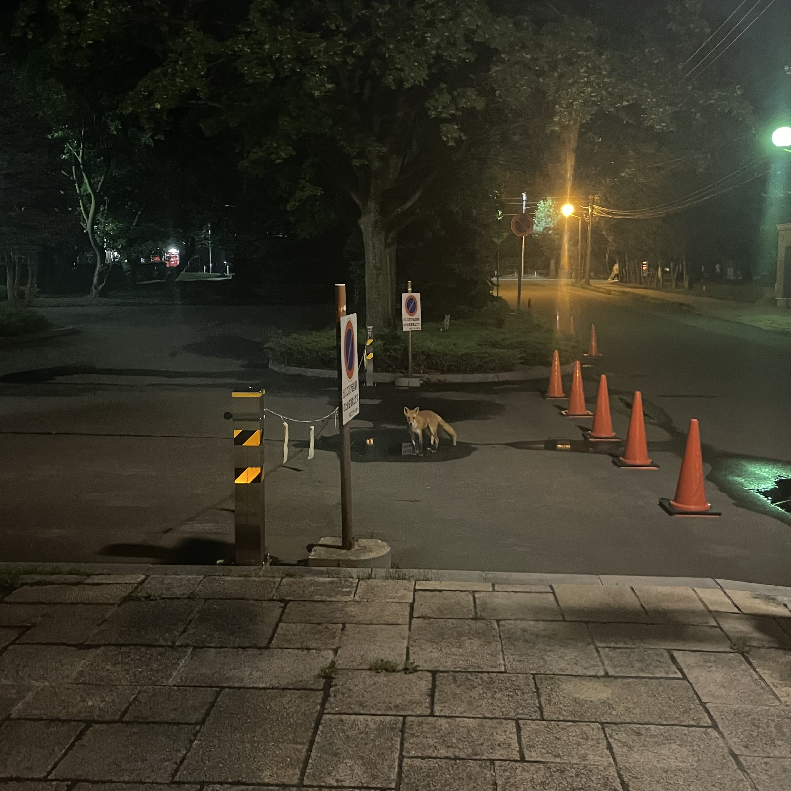

 宇宙 / 日本 / 世田谷

上一次出国已经是2018年的事了[^1]。五年的时间就这样不明不白地度过了，过去的每一天像发酵的面团黏连在一起，包裹着我的头脑和身体。这种黏连的日子让我感到困惑，继而产生了一种不真实感——我实在是活在这个世界上，还只是漂浮在虚幻的边境？好在连绵的时间也稀释了一次次剧变带来的冲击。难以接受的事情们仿佛确实发生在昨天，但情感上似乎已经相隔甚久。

但无论如何，距离上一次出国旅行确确实实已经过去了五年。产生计划时已经到了七月，考虑到需要准备一个多月后去美国读书，不妨就近去趟日本吧！

## 東京殘響[^2]
2023年夏天的东亚出现了若干年不遇的高热天气，高温高湿的东京实在不宜生存。我们在几个网红景点和东大早大走了走，就匆匆飞往北边的函馆。

六本木之丘观景台。

比起更有名的晴空塔skytree，港区的六本木之丘观景台人不算很多（或许也是因为お盆刚刚结束），也不会被上图左边这栋毫无美感的高楼阻挡视野。
不过放在日元大跳水的今天，恐怕很难在人流中找到好的观景位。

俄语版《奇鸟行状录》，或者应该叫《拧发条鸟编年史》？

早稻田大学里的村上春树图书馆，算是为了这点醋专门来的早大。馆内收藏了各种语言版本的村上春树作品。除去藏书以外，图书馆本身是隈研吾的作品，有个很有设计感的木质阶梯，可惜当天维护没有开放，有兴趣的可以搜索一下。图书馆地下有个不算小的咖啡厅。早大当天似乎在开某个应用数学的会议，对桌的参会小哥一直在讨论论文，可惜是native水平的日语，听不懂一点。事后google了一下这个会，发现Weinan E还来拿了个best paper，有点难绷。

赶飞机当天早早起床感受了一下皇居跑步。感叹日本跑步的人确实不少，见识到了不少一眼六十岁以上的跑步仙人。但皇居路线感觉不是很适合跑步，道路窄且坑洼很多，一些地方有10度以内的小坡，靠近车道还要为吸收二氧化碳作出不少贡献。但沿途的景色确实没话说，给绕着北大外围跑了一个暑假即将跑吐的我带来了极大的精神慰藉。

七点后温度迅速飙升到30度，赶紧跑路回酒店了。

[^1]: 与撰写时间不同，本文记录的是2023年8月的日本旅行(w/ WiseRomu)。在旅行期间断断续续记录了一些文字与图片，直到今天才想起整合。

[^2]: 游记内容与该漫画无任何联系。孩子不懂事写着玩的。

## 函馆

五角星形的战争要塞——有种莫名的荒诞

五芒星形状的五棱郭公园曾经作为易守难攻的要塞而建造。这里是倒幕运动最后一战的发生地，因此游览路线充满了幕府战争的文化介绍，可惜我除了看过一点银魂以外对这些一无所知。

函馆山夜景

世界三大夜景之一，不枉我们在山顶餐厅坐了两个小时才等到日落。现场的景色要比照片还要漂亮太多，至少我感觉比和他并列的维港要壮观不少。这里被称为百万夜景，本来以为是抽象层面上千金难求的意思，没想到是因为当地统计一晚上亮灯真的要花一百万的电费...感觉添加了不少搞笑色彩。

值得一提的是，今年的柯南剧场版『100万ドルの 五稜星』的背景地就是函馆。虽然在大陆和北美上院线都遥遥无期，但看标题就知道五棱郭公园和函馆山应该有不少戏份。据说某段动作戏的背景采用的是函馆山的夜景实景，第一次听说这种操作，感觉也算毅种3d渲染2d了。

函馆似乎是为了旅游业而存在的城市。JR站边除了各种酒店少有别的建筑，再靠近居民区一些，晚上也很少有亮着的民宅（这一百万的灯都亮到路灯去了么？）但无论如何，函馆作为名气不大的小城市，在旅游体验上实在是很让人惊喜。函馆朝市和红砖仓库都值得一去，即使是小丑汉堡这种被小红书不齿的网红特产，也远胜过我在美国见到的大部分汉堡了。

## 札幌，小樽，富良野

坐了四个小时的新干线到达札幌。札幌市内感觉没什么景点，倒是得益于方正的城市规划，商区十分集中，应该很适合逛街购物生活，对于足够耐冷的人是个挺宜居的地方。我们没有在市内见到什么值得称道的景点，于是分两天去了小樽和美瑛。

札幌时计塔

小樽确实有些乏善可陈，没有雪景滤镜的运河普普通通，天狗山对我们也不太有吸引力。午饭的超大单人份海鲜饭+炸鸡套餐倒是震撼了我和同学，这一份好像才只要不到1500JPY？真是实实又惠惠！

画面外还有一整盘我们不知死活单点的同样巨量的唐揚，很难想象最后是怎么吃完的。

吃完饭突然下起了大雨。之后做了些什么我全然忘记了。只记得某种*熟悉*的情绪开始蔓延，身体在水雾里无意识地漫游了很久，反应过来时雨已经停了。翻相册时惊讶地发现自己在雨里拍摄了小樽的唯一一张照片。

下一个目的地是富良野，准确一点说应该是美瑛和富良野。早起坐了一个半小时的电车终于到达美瑛后，我们意识到了道东公共交通的痛苦之处。根据小红书的指引，我们很快租了电动自行车，准备绕富良野骑行。不得不说电动自行车骑起来确实省劲，踩狠了甚至有种该死的推背感.jpg。过了花季的富良野游客寥寥，但是在田间骑行的确令人神清气爽，很难不产生一种想今后移居过农村生活的冲动。显然，还没有见识到美国这个遍地平房大农村的我，尚未意识到这种想法多么离谱，算是提前感受了一把midwest emo。

临走前最后一晚去酒店旁的中岛公园跑步。先吐槽一下日本的奇怪方言，中岛公园的官方名是なかじま(nakajima)，但是印象中某些中岛姓的艺人都读なかしま(nakashima)，比如中岛美嘉(nakashima mika)和中岛由贵(nakashima yuki)。本来以为是作地名和作姓氏的读法区别，但是又有中岛美雪(nakajima miyuki)是例外。google了半天在红迪的找到了一样被迷惑的美国人发的帖子，回复里说西部和东部的岛字读音差异，中岛美嘉和贵贵是鹿儿岛/和歌山出身所以是前者，而北海道这边都是后者。具体的渊源似乎某一方是传统读法，后面逐渐演化歪了。只能说，啊，很神秘。

低清预警

言归正传，跑步时远远看到一只狗在无人的路灯下站着。越近越看越觉得奇怪，这狗似乎有点消瘦。直到走进才发现居然是只狐狸（应该是吧）！算是人生第一次见到野生狐狸。有意思的是，照片中的路口左边拐进去就是一个不大的神社鸟居。神社+狐狸的经典组合这样出现在了城市里，这里也并非什么山林或是乡村，该说是在旅行最后多了一抹奇幻色彩吗？