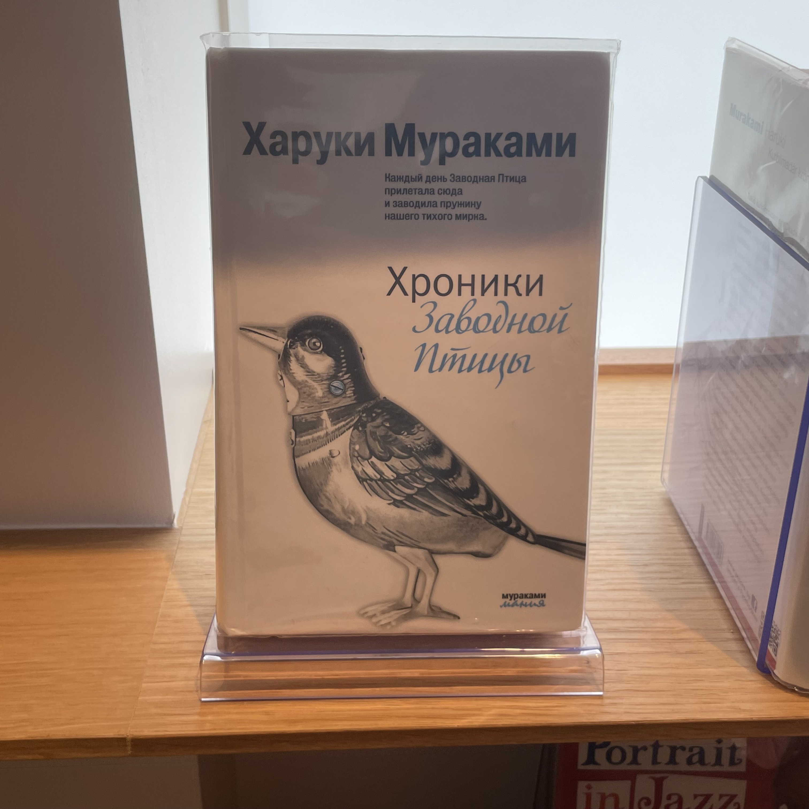

**注：与撰写时间不同，本文记录的是2023年8月的日本旅行(w/ WiseRomu)。在旅行期间断断续续记录了一些文字与图片，直到今天才想起整合。**

 宇宙 / 日本 / 世田谷

上一次出国已经是2018年的事了。过去的五年就这样不明不白地度过了，每一天像发酵的面团黏连在一起，包裹着我的四肢和大脑。这种黏连的日子让我感到困惑，继而产生不真实感——我实在是活在这个世界上，还只是漂浮在虚幻的边境？好在连绵的时间稀释了一次次剧变带来的冲击。难以接受的事情们仿佛确实发生在昨天，但情感上似乎已经相隔甚久。

但无论如何，距离上一次出国旅行确确实实已经过去了五年。产生计划时已经到了七月，考虑到需要准备一个多月后去美国读书，不妨就近去趟日本吧！

## 東京殘響[^1]
2023年夏天的东亚出现了若干年不遇的高热天气，高温高湿的东京实在不宜生存。我们在几个网红景点和东大早大走了走，就匆匆飞往北边的函馆。

六本木之丘观景台。

比起更有名的晴空塔skytree，港区的六本木之丘观景台人不算很多（或许也是因为お盆刚刚结束），也不会被上图左边这栋毫无美感的高楼阻挡视野。
不过放在日元大跳水的今天，恐怕很难在人流中找到好的观景位。

俄语版《奇鸟行状录》，或者应该叫《拧发条鸟编年史》？

早稻田大学里的村上春树图书馆，算是为了这点醋专门来的早大。馆内收藏了各种语言版本的村上春树作品。除去藏书以外，图书馆本身是隈研吾的作品，有个很有设计感的木质阶梯，可惜当天维护没有开放，有兴趣的可以搜索一下。图书馆地下有个不算小的咖啡厅。早大当天似乎在开某个应用数学的会议，对桌的参会小哥一直在讨论论文，可惜是native水平的日语，听不懂一点。事后google了一下这个会，发现Weinan E还来拿了个best paper，有点难绷。

[^1]: 游记内容与该漫画无任何联系。

## 函馆&札幌

五棱郭公园

五芒星形状的五棱郭城曾经作为易守难攻的要塞而建造。这里是倒幕运动最后一战的发生地，因此游览路线充满了幕府战争的文化介绍，可惜我除了看过银魂以外对这些一无所知。

函馆山夜景

世界三大夜景之一，不枉我们在山顶餐厅坐了两个小时才等到日落。现场的景色要比照片还要漂亮太多，至少我感觉比和他并列的维港要壮观不少。这里被称为百万夜景，本来以为是抽象层面上千金难求的意思，没想到是因为当地统计一晚上亮灯真的要花一百万的电费...感觉添加了不少搞笑色彩。

值得一提的是，今年的柯南剧场版『100万ドルの 五稜星』的背景地就是函馆。虽然在大陆和北美上院线都遥遥无期，但看标题就知道五棱郭公园和函馆山应该有不少戏份。据说某段动作戏的背景采用的是函馆山的夜景实景，第一次听说这种操作，感觉也算毅种3d渲染2d了。

函馆似乎是为了旅游业而存在的城市。JR站边除了各种酒店少有别的建筑，再靠近居民区一些，晚上也很少有亮着的民宅（这一百万日元的灯都亮到哪里去了？）但无论如何，函馆作为名气不大的小城市，在旅游体验上实在是很让人惊喜。函馆朝市和红砖仓库都值得一去，即使是小丑汉堡这种被小红书不齿的网红特产，也远胜过我在美国见到的大部分汉堡了。

坐了四个小时的新干线到达札幌。札幌市内感觉没什么景点，倒是得益于方正的城市规划，商区十分集中，应该很适合逛街购物生活，对于足够耐冷的人是个挺宜居的地方。我们没有在市内见到什么值得称道的景点，于是分两天去了小樽和美瑛。

小樽确实有些乏善可陈，没有雪景滤镜的运河普普通通，天狗山对我们也不太有吸引力。